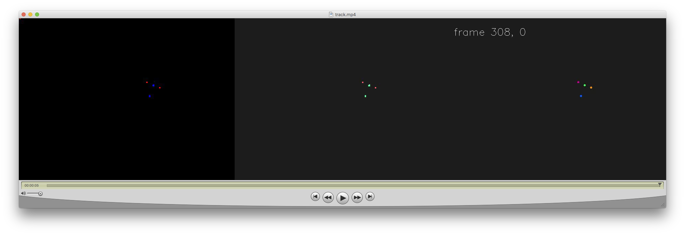
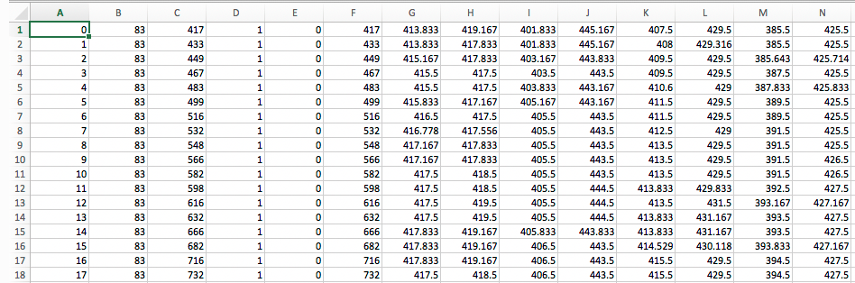

Process Video Files
===================
#. Place :download:`trackHead.py<../../trackHead.py>` into a folder that contains the timestamps.csv and .mpg files that you want processed
#. Open a terminal window
#. :ref:`Switch into your trackingEnv<switch>` if you are not already in it
#. Navigate to the folder that you just placed trackHead.py into in step 1
#. Run the trackHead.py script by entering the following:

.. code::

  python trackHead.py

All of the separate .mpg files will be combined into a single .mp4 that contains 3 frames stiched together.

The left frame is the original video footage.The center frame shows the pixels that remain after filtering
for red and blue. The right frame places circlular marks at the centers of the filtered pixel clusters.

A .csv file is also created that combines the timestamp.csv data with x,y coorindinates of the tracked LEDs

